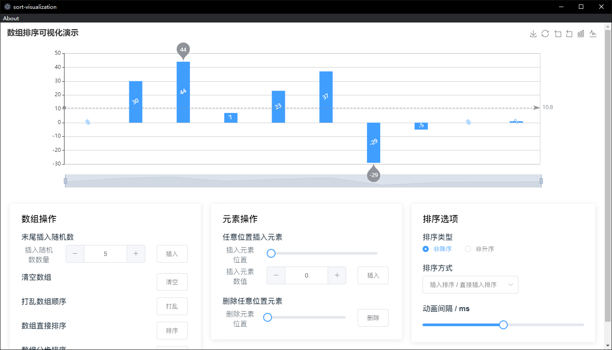
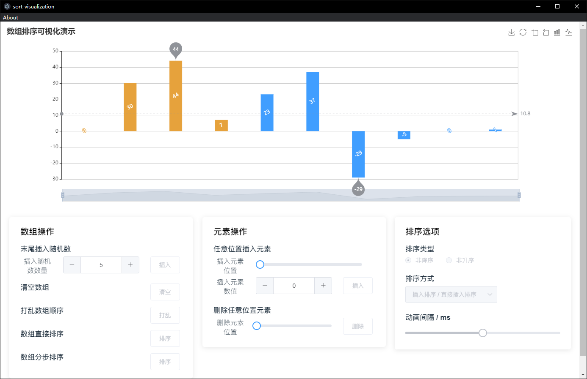
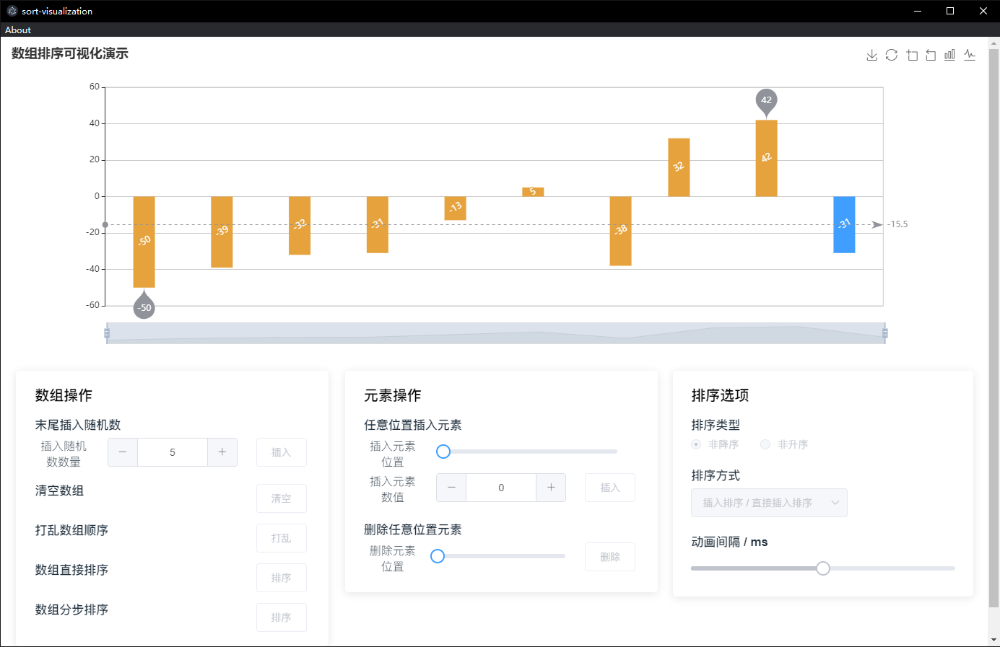
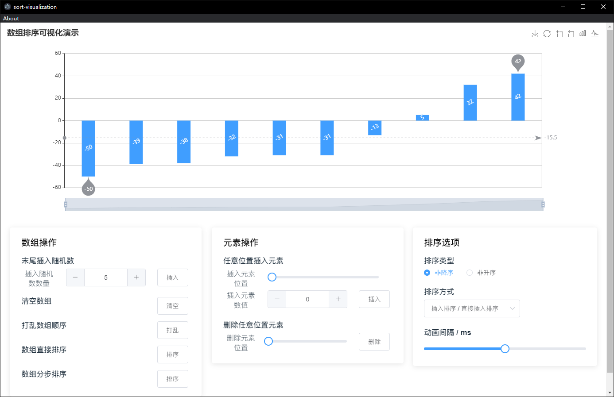

# sort-visualization

## General

实现了包含直接插入排序、折半插入排序、希尔排序、冒泡排序、快速排序、简单选择排序、堆排序以及归并排序的可视化演示功能。

## Project setup
```
npm install
```

### Compiles and hot-reloads for development
```
npm run serve
```

### Compiles and minifies for production
```
npm run build
```

### Lints and fixes files
```
npm run lint
```

### Customize configuration
See [Configuration Reference](https://cli.vuejs.org/config/).

## Final Results









